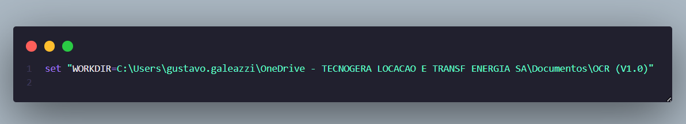
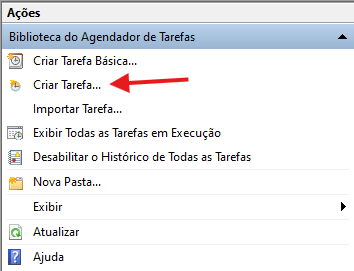
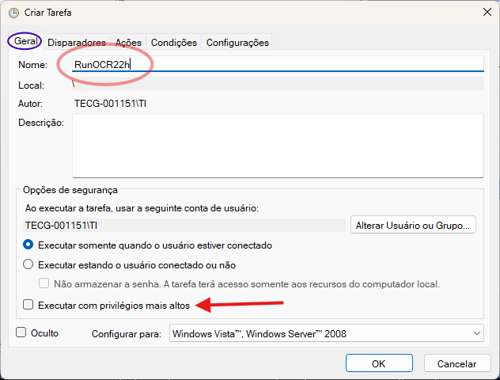
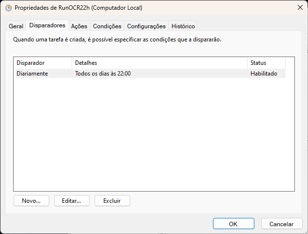
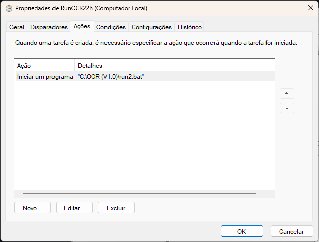
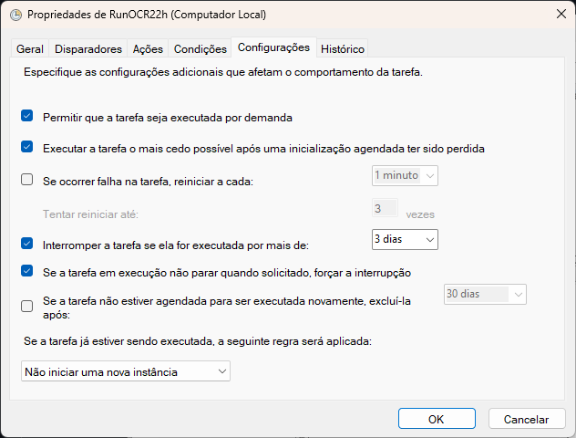

# Checklist OCR 

Automates the retrieval of checklist images from Dropbox and sends them to an OCR step powered by the OpenAI API. The pipeline returns a clean JSON payload (focused on reading the **patrimônio** code), ready to consume in downstream systems or to save to disk for auditing.
 
> `LinkG.py` lists recent images from Dropbox → `OCR.py` runs OCR on each image → `All.py` ties it all together and prints (or saves) JSON. 

----

## How to set `run.bat` :
- Change this line to your own path



---

## Features

- 🔎 Lists images from a target Dropbox folder (with filters like `_c57_`).
- 🔗 Generates stable **direct** links for each file (shared links, normalized).
- 🤖 Sends each image to OpenAI and extracts only the **patrimônio**.
- 🧾 Outputs structured JSON (one object per image).
- 🕙 Can be scheduled to run daily (e.g., **22:00**) via Windows Task Scheduler.

> `LinkG.py` search files 1 day before the run.
---

# Task Scheduler:

## First step


## Second step


## Third step


## Fourth step


## Fifth step



## Repository Structure.

```
├─ all.py # Alternative entrypoint.
    └─ out/ logs/ # Created at runtime for outputs & logs (optional)
├─ LinkG.py # Dropbox listing & link generation
├─ OCR.py # OCR step using OpenAI API
├─ id.json # (Local) reference data used by the OCR prompt
├─ .env # Environment variables (not committed)
 ```

## Essentials Commands 
``` console

cd "C:\..\..\..\..\OCR (V1.0)"

python3.11 -m venv .venv

.venv\Scripts\activate pip install dropbox python-dotenv openai pytz

python all.py

```


